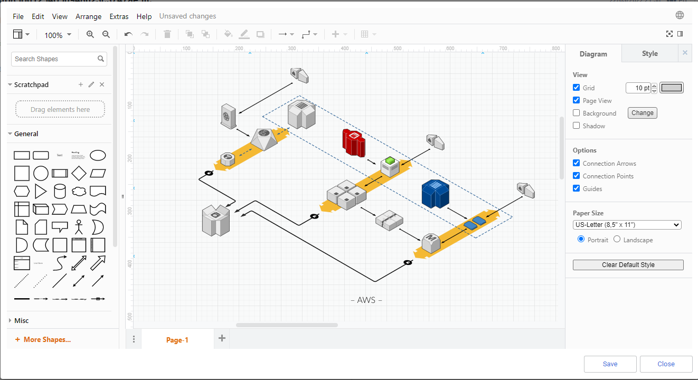
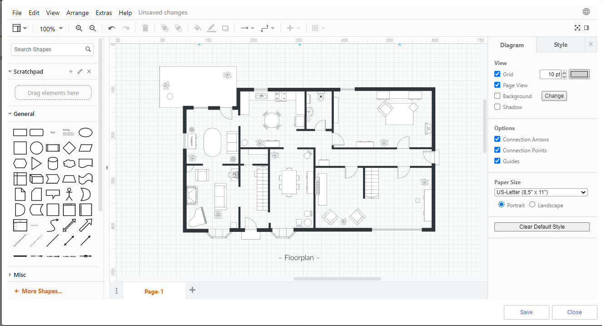
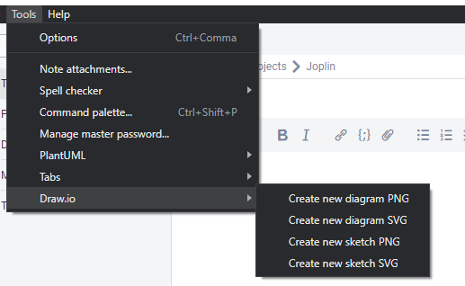
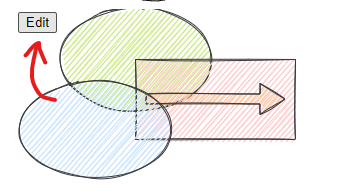
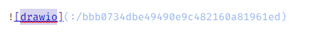
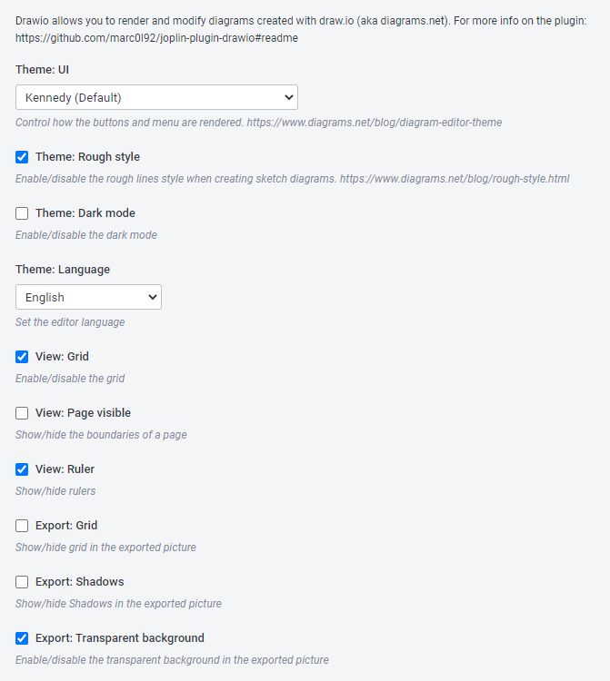

# Joplin Plugin - draw.io

This plugin allows you to create diagrams using the editor [diagrams.net](https://www.diagrams.net) (aka. draw.io).

This plugin needs an internet connection to work.

## Install the plugin

### Automatic installation

Use the Joplin plugin manager to install it (`Joplin > Options > Plugins`).
Search for `draw.io`.

### Manual installation

- Download the last release from this repository.
- Open `Joplin > Options > Plugins > Install from File`
- Select the jpl file you downloaded.

# Create new diagram

Use the tools menu to create a new diagram and paste it in the note.

> The diagram will be inserted where the cursor is.

You can create your diagram using 2 different type of file format:
* PNG: raster format
* SVG: vectorial format

The sketch mode configures the diagram editor to simplify the hand drawing.

# Edit diagram

If the plugin detects that the image is a draw.io diagram it will show an edit button on the top right when your mouse hover on the image.

The plugin identify an image as a diagram if the alternative text is drawio and if the resource title starts with `drawio-`.

# Settings

# Development
If you want to contribute to this plugin you can find here some useful references:

- [Joplin - Getting started with plugin development](https://joplinapp.org/api/get_started/plugins/)
- [Joplin - Plugin API reference](https://joplinapp.org/api/references/plugin_api/classes/joplin.html)
- [Joplin - Data API reference](https://joplinapp.org/api/references/rest_api/)
- [Joplin - Plugin examples](https://github.com/laurent22/joplin/tree/dev/packages/app-cli/tests/support/plugins)
- [Draw.io parameters](https://www.diagrams.net/doc/faq/supported-url-parameters)

https://www.diagrams.net/blog/embedding-walkthrough